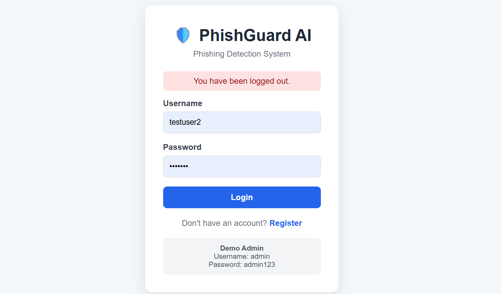
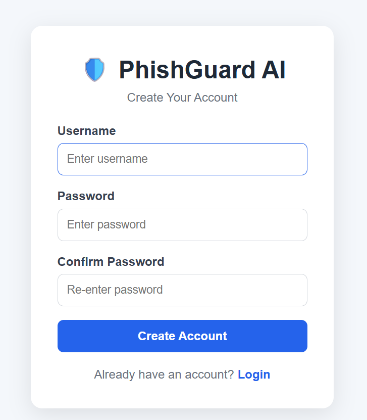
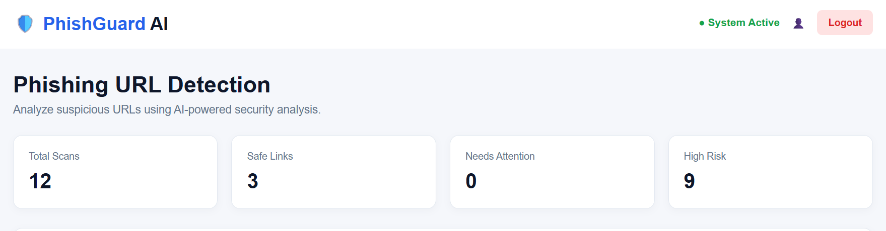
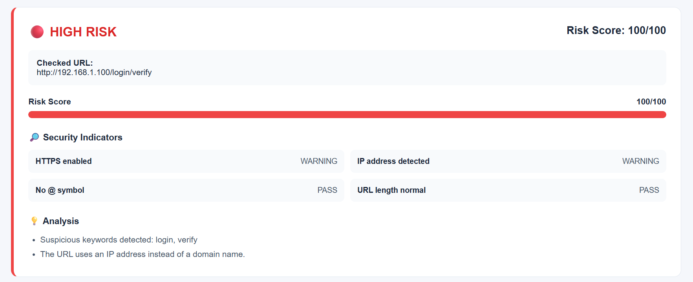
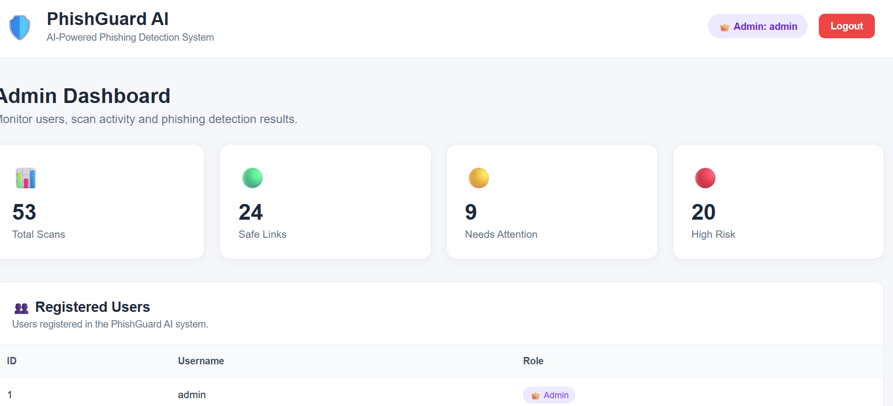

 🛡️ PhishGuardAI

AI-Powered Phishing URL Detection System

PhishGuardAI is a web-based phishing detection system that uses **Machine Learning** and URL-based security analysis to identify potentially malicious URLs.

The system analyzes a submitted URL and provides a **risk score**, security indicators, and an overall classification such as **SAFE, SUSPICIOUS, or PHISHING**.

---

 🚀 Features

* 🔍 **Phishing URL Detection**
* 🤖 **Machine Learning-based URL Classification**
* 📊 **Risk Score Analysis**
* 🔐 **User Registration & Login**
* 👤 **User-specific Scan History**
* 🛡️ **Security Indicators**
* 🧠 **Analysis Reasons**
* 👨‍💼 **Admin Dashboard**
* 📈 **Scan Statistics**
* ⚡ **Fast URL Analysis**
* 🌐 **Simple and User-friendly Web Interface**

---

🖥️ Application Screenshots

🔐 Login


 📝 Registration



 🟢 Safe URL Result



🔴 High Risk URL Result



👨‍💼 Admin Dashboard



---

 🛠️ Technologies Used

| Technology       | Purpose                   |
| ---------------- | ------------------------- |
| **Python**       | Backend development       |
| **Flask**        | Web application framework |
| **Scikit-learn** | Machine Learning          |
| **Joblib**       | ML model loading          |
| **Pandas**       | Data processing           |
| **SQLite**       | Database                  |
| **HTML**         | Web structure             |
| **CSS**          | User interface styling    |
| **JavaScript**   | Client-side functionality |

---

🧠 Machine Learning

PhishGuardAI uses a **Random Forest Classifier** for URL classification.

The model analyzes URL-based features such as:

* URL length
* Domain length
* HTTPS availability
* IP address usage
* Number of subdomains
* Special characters
* Suspicious keywords
* Digits and letters
* URL obfuscation indicators

 Prediction Classes

```text
0 → PHISHING
1 → LEGITIMATE
```

The application converts the model prediction into a user-friendly security result and risk score.

---

📁 Project Structure

```text
PhishGuardAI/
│
├── templates/
│   ├── index.html
│   ├── login.html
│   ├── register.html
│   └── admin.html
│
├── screenshots/
│   ├── safe-result.png
│   ├── high-risk-result.png
│   ├── login.png
│   ├── register.png
│   └── admin-dashboard.png
│
├── app.py
├── ml_model.py
├── phishguard_model_v3.pkl
├── phishing_dataset.csv
├── phishguard.db
├── requirements.txt
├── .gitignore
└── README.md
```

---

⚙️ Installation

1. Clone the Repository

```bash
git clone https://github.com/karpahadharshu-tech/PhishGuardAI.git
```

 2. Navigate to the Project Folder

```bash
cd PhishGuardAI
```

 3. Create a Virtual Environment

```bash
python -m venv venv
```
 4. Activate the Virtual Environment

**Windows:**

```bash
venv\Scripts\activate
```
 5. Install Dependencies

```bash
pip install -r requirements.txt
```


▶️ Run the Application

Start the Flask application:

```bash
python app.py
```

Then open:

```text
http://127.0.0.1:5000
```

Register an account, log in, and enter a URL to analyze its security risk.


🔐 Authentication

PhishGuardAI provides separate access for:

👤 User

* Register an account
* Login securely
* Scan URLs
* View personal scan history
* View personal statistics

👨‍💼 Admin

* Access the admin dashboard
* View registered users
* View all scan records
* View overall scan statistics


 📊 Security Analysis

For every scanned URL, the system provides:

* Overall classification
* Risk score
* HTTPS status
* Domain/IP analysis
* Suspicious character detection
* URL length analysis
* Suspicious keyword analysis
* Explanation of detected security indicators

 🎯 Project Purpose

The purpose of PhishGuardAI is to provide a simple and accessible tool for detecting potentially malicious URLs and increasing awareness of phishing threats.

The project demonstrates the practical use of **Machine Learning, Flask, database management, authentication, and web development** in a cybersecurity application.


 👩‍💻 Author

Karpaha 

GitHub:
https://github.com/karpahadharshu-tech


 ⭐ Future Enhancements

* 🔗 Real-time URL reputation checking
* 📧 Email phishing detection
* 🌍 Domain reputation analysis
* 📱 Mobile-friendly interface
* 🧠 Improved ML models
* 📈 Advanced analytics and visualization


📜 License

This project is developed for **educational and academic purposes**.
